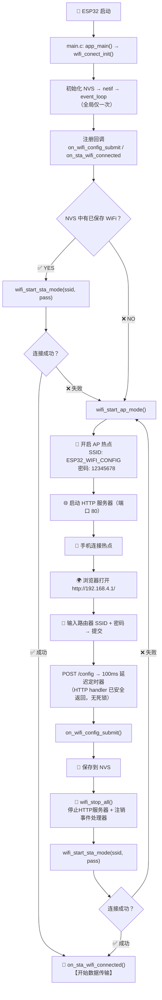

# 项目名称：基于ESP32S3N16R8单片机下开发的xiaohulu_AI智能小车

# 一、WiFi 配网流程

```mermaid
flowchart TD
    A["🚀 ESP32 启动"] --> B["main.c: app_main() → wifi_conect_init()"]
    B --> C["初始化 NVS → netif → event_loop
    （全局仅一次）"]
    C --> D["注册回调
    on_wifi_config_submit / on_sta_wifi_connected"]
    D --> E{"NVS 中有已保存 WiFi？"}

    E -->|✅ YES| F["wifi_start_sta_mode(ssid, pass)"]
    E -->|❌ NO| G["wifi_start_ap_mode()"]

    F --> H{"连接成功？"}
    H -->|✅ 成功| I["🎉 on_sta_wifi_connected()
    【开始数据传输】"]
    H -->|❌ 失败| G

    G --> J["📡 开启 AP 热点
    SSID: ESP32_WIFI_CONFIG
    密码: 12345678"]
    J --> K["🌐 启动 HTTP 服务器（端口 80）"]
    K --> L["📱 手机连接热点"]
    L --> M["🌍 浏览器打开 http://192.168.4.1/"]
    M --> N["📝 输入路由器 SSID + 密码 → 提交"]
    N --> O["POST /config → 100ms 延迟定时器
    （HTTP handler 已安全返回，无死锁）"]
    O --> P["on_wifi_config_submit()"]
    P --> Q["💾 保存到 NVS"]
    Q --> R["🛑 wifi_stop_all()
    停止HTTP服务器 + 注销事件处理器"]
    R --> S["wifi_start_sta_mode(ssid, pass)"]
    S --> T{"连接成功？"}
    T -->|✅ 成功| I
    T -->|❌ 失败| G
```